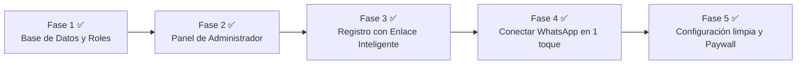

# 📋 PLAN MAESTRO DE IMPLEMENTACIÓN - TRANSICIÓN A SAAS (PESITO)
> **Documento para transferencia a Codex / Nueva Sesión de IA**  
> **Fecha de corte:** 2 de Octubre de 2026  
> **Repositorio:** `ThomasMariani11/chatbot-gastos` (Rama `main`)  
> **Stack:** React 18, TypeScript, Vite, Supabase (PostgreSQL, Auth, Edge Functions en Deno), PWA  
> **Último commit:** `5cd9cb7` (`feat: add profiles, invitation_codes tables, and sync phone on webhook`)  
> **Supabase Project Ref:** `ystyatotldslfmucvgsq` (URL: `https://ystyatotldslfmucvgsq.supabase.co`)  
> **Super Admin actual:** `thomi_mariani@hotmail.com` (WhatsApp: `5493512334073`)

---

## 🎯 OBJETIVO DEL PROYECTO
Convertir la aplicación web/PWA actual de finanzas personales ("Pesito") en un **SaaS comercializable** con:
1. **Control de acceso estricto mediante Códigos de Invitación de un solo uso** (para evitar que la gente se pase la app o se registre sin pagar).
2. **Panel de Administrador exclusivo** para generar licencias/códigos, ver métricas del negocio y gestionar clientes y suscripciones.
3. **Flujo de Onboarding 100% automático** para que los clientes se registren solos con un enlace inteligente y conecten su WhatsApp en 1 toque.
4. **Vista de Cliente limpia y comercial** eliminando advertencias técnicas de la pantalla de configuración.

---

## 📍 ESTADO ACTUAL: FASE 1 COMPLETADA Y TESTEADA ✅

La **Fase 1 (Base de Datos & Roles en Supabase)** ya está 100% desplegada y verificada en la base de datos de producción:

### 1. Tablas y Estructuras en Supabase
* **`public.profiles`**:
  - `id` (`UUID`, PK -> `auth.users.id` on delete cascade)
  - `email` (`TEXT`)
  - `role` (`TEXT` check in `'admin'`, `'client'`, default `'client'`)
  - `subscription_status` (`TEXT` check in `'active'`, `'expired'`, `'suspended'`, default `'active'`)
  - `subscription_until` (`TIMESTAMPTZ`, `null` = vitalicio/sin vencimiento)
  - `phone_number` (`TEXT`, sincronizado automáticamente con WhatsApp)
  - `created_at`, `updated_at` (`TIMESTAMPTZ`)
* **`public.invitation_codes`**:
  - `id` (`UUID`, PK)
  - `code` (`TEXT`, UNIQUE, ej. `PESO-9F4K`)
  - `duration_days` (`INTEGER`, ej. 30, 90, 365, o `null` para vitalicio)
  - `is_used` (`BOOLEAN`, default `false`)
  - `used_by` (`UUID` -> `auth.users.id`)
  - `used_at` (`TIMESTAMPTZ`)
  - `created_by` (`UUID` -> `auth.users.id`)
  - `notes` (`TEXT`, ej. *"Pagó Juan Pérez - MP"*)
  - `created_at` (`TIMESTAMPTZ`)

### 2. Funciones RPC en Supabase
* `public.check_invitation_code(p_code text)`:
  - Función pública segura (`SECURITY DEFINER`).
  - Verifica si el código existe y no fue usado.
  - Devuelve `{ valid: true, duration_days: 30 }` o `{ valid: false, error: '...' }`.
* `public.redeem_invitation_code(p_code text, p_user_id uuid)`:
  - Función atómica (`SECURITY DEFINER`).
  - Bloquea la fila con `FOR UPDATE`, quema el código (`is_used = true`, `used_by = p_user_id`), calcula `subscription_until = now() + duration_days` y actualiza `public.profiles`.
  - Rechaza cualquier intento de reuso o código inválido.
* `public.bootstrap_user()`:
  - Trigger automático sobre `auth.users`: crea automáticamente el perfil en `public.profiles`, categorías por defecto, `app_settings` y `whatsapp_links`.

### 3. Webhook de WhatsApp Desplegado
* `supabase/functions/whatsapp-webhook/index.ts`:
  - Desplegado con `--no-verify-jwt`.
  - Cuando un usuario envía `VINCULAR <código>` y se vincula con éxito, actualiza automáticamente `whatsapp_links` y `profiles.phone_number = message.from`.

### 4. Pruebas Reales Ejecutadas y Aprobadas en Producción
- [x] Rechazo de códigos inexistentes (`valid: false`).
- [x] Reconocimiento de códigos reales válidos (`valid: true`).
- [x] Canje atómico y cálculo de días (`success: true`, calcula fecha a 30 días).
- [x] Rechazo estricto si se intenta reutilizar un código ya quemado.
- [x] Usuario admin actual (`thomi_mariani@hotmail.com`) configurado con `role = 'admin'` y acceso perpetuo.

---

## 🚀 ROADMAP RESTANTE: FASES 2 A 5

---

## 📌 GUÍA TÉCNICA DETALLADA: FASE 2 (SIGUIENTE PASO INMEDIATO)

### Objetivo de la Fase 2:
Crear la vista de **Panel de Administrador** (`AdminPanel.tsx`) en el frontend, accesible solo para usuarios con `role === 'admin'`.

### Archivos a crear / modificar:
1. **`src/AdminPanel.tsx` (Nuevo componente)**:
   - **Barra superior**: Título "Panel de Administrador", botón para alternar a "Ver mi Dashboard".
   - **Tarjetas de Métricas**:
     - Total clientes activos (`profiles` con `role = 'client'`).
     - Clientes próximos a vencer en los próximos 7 días (`subscription_until <= now() + 7 days`).
     - Códigos disponibles (`invitation_codes` con `is_used = false`).
     - Total transacciones o eventos registrados.
   - **Formulario Generador de Códigos**:
     - Selector de Duración: `30 días (1 mes)`, `90 días (3 meses)`, `1 año (365 días)`, `Vitalicio (sin vencimiento)`.
     - Campo Nota / Cliente: texto opcional (ej. "Juan Pérez - Mercado Pago").
     - Botón `Generar Código de Invitación`:
       - Genera un código legible aleatorio (ej. `PESO-` + 4 o 6 caracteres alfanuméricos en mayúsculas).
       - Inserta en `invitation_codes` (con `created_by = userId`, `duration_days`, `notes`).
     - Al generarse, muestra un modal o banner con el código y un botón destacado:
       `[ 📲 Copiar mensaje para WhatsApp ]`
       - Copia al portapapeles el texto pre-armado:
         > *"¡Hola! Gracias por sumarte a Pesito 💰.*\n\n*Para activar tu cuenta:*\n*1. Entrá a este enlace exclusivo: https://<dominio>/?invitacion=PESO-XXXX*\n*2. Creá tu contraseña.*\n*3. Tocá 'Instalar' para tenerla como app en tu pantalla de inicio.*\n*4. ¡Listo! Ya podés registrar tus gastos por WhatsApp."*
   - **Tabla de Gestión de Clientes**:
     - Columnas: Email, WhatsApp vinculado (`phone_number`), Estado (`Activo` / `Próximo a vencer` / `Vencido`), Vence el (`subscription_until`), Acciones:
       - Botón `+ 30 días` (ejecuta un update sumando 30 días a `subscription_until`).
       - Botón `Pausar / Reactivar cuenta` (`subscription_status = 'suspended'` o `'active'`).
       - Botón directo para abrir chat de WhatsApp con el cliente si tiene número vinculado (`https://wa.me/<phone_number>`).
   - **Tabla de Códigos de Invitación**:
     - Columnas: Código, Duración, Nota, Estado (`Disponible` / `Usado por <email>`), Fecha de creación, Acciones:
       - Botón `Copiar enlace`.
       - Botón `Anular / Eliminar` (si no fue usado).

2. **`src/App.tsx` (Actualizar navegación)**:
   - Al cargar la sesión del usuario, consultar `public.profiles` por `id = session.user.id`.
   - Guardar en estado `userProfile`: `{ role: 'admin' | 'client', subscription_status, subscription_until }`.
   - Si `userProfile.role === 'admin'`:
     - Agregar opción de vista: `type View = 'dashboard' | 'settings' | 'admin'`.
     - En el header del Dashboard, mostrar botón o badge discreto `[ 🛠️ Panel Admin ]` que cambie a `view = 'admin'`.

3. **`src/styles.css`**:
   - Agregar estilos limpios para el panel de administración (métricas en cards, tablas responsive, badges de estado verde/amarillo/rojo, botones de acción).

---

## 📌 GUÍA TÉCNICA: FASE 3 (REGISTRO CON ENLACE INTELIGENTE)

### Objetivo:
Permitir que los clientes se registren solos, validando el código de invitación desde la URL o tipeado.

### Archivos a modificar:
1. **`src/Login.tsx`**:
   - Detectar si la URL contiene `?invitacion=CODIGO` o `?code=CODIGO`.
   - Si contiene código:
     - Automáticamente cambiar a la pestaña "Crear cuenta".
     - Llamar a `supabase.rpc('check_invitation_code', { p_code: codigo })`.
     - Mostrar feedback visual: `[ ✅ Código verificado: Plan de X días ]` o `[ ❌ Código inválido o ya utilizado ]`.
   - Formulario de Registro:
     - Email
     - Contraseña
     - Repetir contraseña
     - Código de invitación (auto-completado si vino por URL, o editable si entró directo).
   - Al hacer submit:
     1. `supabase.auth.signUp({ email, password })`.
     2. Apenas se crea el usuario, llamar a `supabase.rpc('redeem_invitation_code', { p_code: codigo, p_user_id: user.id })`.
     3. Redirigir directamente al Dashboard listo para usar.
   - Si alguien entra a registrarse sin código:
     - Mostrar advertencia: *"Para registrarte necesitás un código de invitación"* con botón `[ 💬 Solicitar acceso por WhatsApp ]`.

---

## 📌 GUÍA TÉCNICA: FASE 4 (CONECTAR WHATSAPP EN 1 TOQUE)

### Objetivo:
Hacer que la vinculación del bot de WhatsApp sea instantánea, sin que el cliente copie códigos ni agende números.

### Archivos a modificar:
1. **`src/Dashboard.tsx` o componente de Onboarding**:
   - Si el usuario no tiene WhatsApp vinculado (`profiles.phone_number` es null o `whatsapp_links.status !== 'active'`):
     - Mostrar banner/card destacada: `[ 🟢 Conectar mi WhatsApp en 1 toque ]`.
   - Al hacer clic:
     - Generar código de 6 dígitos en `whatsapp_links` (como hace `Settings.tsx`).
     - Abrir enlace: `https://wa.me/<NUMERO_BOT>?text=VINCULAR%20<CODIGO>`.
     - Se abre la app de WhatsApp del celular con el mensaje listo. El usuario solo toca **Enviar**.
     - El webhook procesa el mensaje, responde al usuario y actualiza `profiles.phone_number`.
     - El dashboard detecta el cambio por realtime o recarga y muestra `[ ✅ WhatsApp conectado ]`.

---

## 📌 GUÍA TÉCNICA: FASE 5 (LIMPIEZA DE SETTINGS Y PAYWALL AMABLE)

### Objetivo:
Limpiar la pantalla de configuración para clientes y bloquear el acceso cuando vence el período contratado.

1. **`src/Settings.tsx`**:
   - Eliminar avisos de costos de API, fechas de corte técnicas y mensajes pagos.
   - Dejar una vista amigable:
     - Tarjeta "Mi Suscripción": Plan actual, fecha de vencimiento, días restantes, botón para renovar por WhatsApp.
     - Tarjeta "WhatsApp": Número vinculado y botón para cambiar de número.
     - Tarjeta "Categorías": Gestionar categorías personales.
     - Tarjeta "Instalar aplicación": PWA install prompt.
     - Botón "Cerrar sesión".
2. **Control de Vencimiento (`Paywall / Bloqueo`)**:
   - Si `profiles.subscription_status === 'expired'` o `now() > subscription_until` (y no es admin):
     - Mostrar pantalla bloqueante: *"Tu período de suscripción ha finalizado"*.
     - Campo para ingresar un nuevo código de renovación.
     - Botón directo para hablar por WhatsApp y renovar.
